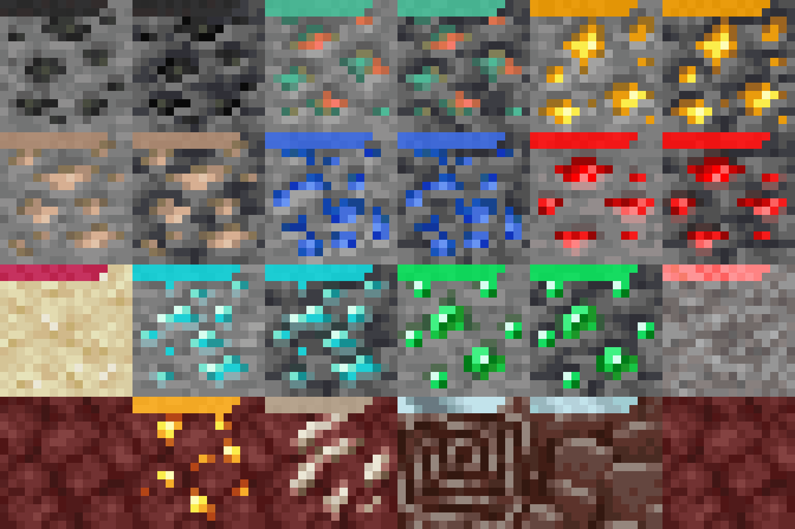

# Obnoxious Ores

Gives all ores a moving ring around them to help you notice them while
mining!



## Building the pack

To build this pack, firs follow the instructions in `get-textures.sh` in
the root of this repo.

Then, you can run the `build.sh` script which will generate the
`obnoxious-ores.zip`:

```sh
./build.sh
```
